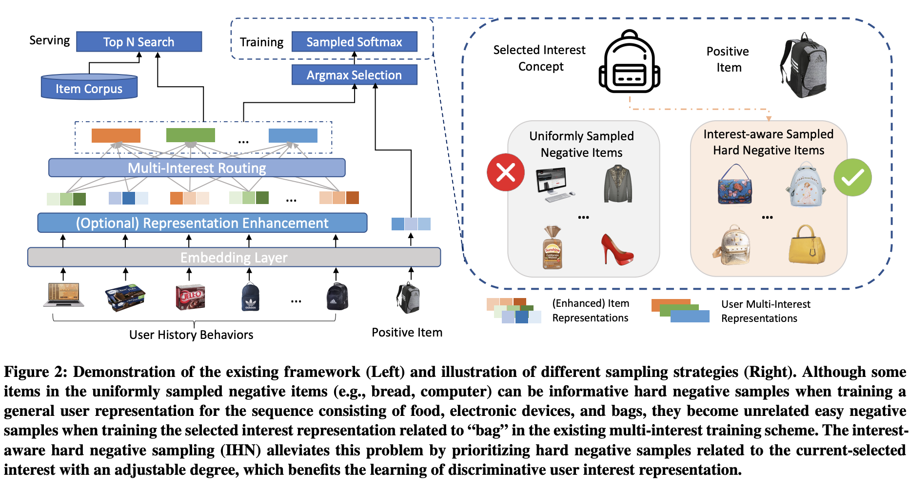

# REMI
The source code for our RecSys 2023 Paper [**"Rethinking Multi-Interest Learning for Candidate Matching in Recommender Systems"**](https://arxiv.org/abs/2302.14532)

## Overview
We propose the REMI framework, consisting of an Interest-aware Hard Negative mining strategy (IHN) and a Routing Regularization (RR) method. IHN emphasizes interest-aware hard negatives by proposing an ideal sampling distribution and developing a Monte-Carlo strategy for efficient approximation. RR prevents routing collapse by introducing a novel regularization term on the item-to-interest routing matrices. These two components enhance the learned multi-interest representations from both the optimization objective and the composition information. REMI is a general framework that can be readily applied to various existing multi-interest candidate matching methods. Experiments on three real-world datasets show our method can significantly improve state-of-the-art methods with easy implementation and negligible computational overhead. The source code will be released.



## Preparation

Our code is based on PyTorch 1.7.1 and runnable for both windows and ubuntu server. Required python packages:

> + numpy
> + torch
> + faiss-gpu


## Dataset
Original links of datasets are:

http://jmcauley.ucsd.edu/data/amazon/index.html  
https://tianchi.aliyun.com/dataset/dataDetail?dataId=649&userId=1  
https://github.com/RUCAIBox/RecSysDatasets  

You can run python process/data.py {dataset_name} to preprocess the datasets.

## Usage

### Prepare data
Make sure `reviews_Books_5.json` file is located in current directory  
(Download the raw file at https://cseweb.ucsd.edu/~jmcauley/datasets/amazon_v2
)   
```
$ git clone https://github.com/Tokkiu/REMI.git
$ cd REMI
$ python process/data.py book
```

### Prepare environment
```
conda env create --file env.yml
```

### Train and evaluate

Run the baseline.
```
$ python src/train.py --model_type ComiRec-SA --gpu 0 --dataset book
$ python src/train.py --model_type ComiRec-SA --gpu 0 --dataset gowalla
$ python src/train.py --model_type ComiRec-SA --gpu 0 --dataset rocket
```

Available baselines:
* ComiRec-SA
* ComiRec-DR
* MIND
* Pop
* GRU4Rec
* DNN

Reproduce the reported result.
```
$ python src/train.py --model_type REMI --gpu 0 --dataset book --rlambda 100 --rbeta 10 
$ python src/train.py --model_type REMI --gpu 0 --dataset gowalla --rlambda 100 --rbeta 1
$ python src/train.py --model_type REMI --gpu 0 --dataset rocket --rlambda 100 --rbeta 0.1
``` 

The *--rbeta* is used to activate **IHN** module.  (available in whole framework)  
The *--rlambda* is used to activate **RR** module.  (available in REMI)

## Cite

If you find this repo useful, please cite
```
@inproceedings{xie2023rethinking,
    title     = {Rethinking Multi-Interest Learning for Candidate Matching in Recommender Systems}, 
    author    = {Yueqi Xie and Jingqi Gao and Peilin Zhou and Qichen Ye and Yining Hua and Jaeboum Kim and Fangzhao Wu and Sunghun Kim},
    booktitle = {Proceedings of the 17th ACM Conference on Recommender Systems},
    year      = {2023},
}
```

## Credit
This repo is based on the following repositories:
* [pytorch_ComiRec](https://github.com/ShiningCosmos/pytorch_ComiRec)
* [ComiRec](https://github.com/THUDM/ComiRec)
* [InfoNCE](https://github.com/Stonesjtu/Pytorch-NCE/)

## Contact
Feel free to contact us if there is any question. (YueqiXIE, yxieay@connect.ust.hk; Jingqi Gao, mrgao.ary@gmail.com; Peilin Zhou, zhoupalin@gmail.com;  Russell KIM, russellkim@upstage.ai)